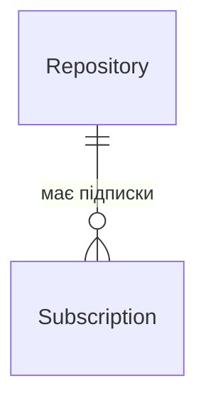

# ADR-002: Вибір PostgreSQL для зберігання підписок

**Статус:** Прийнято  
**Дата:** 2026-04-12  
**Автор:** Ivan (flocky674)

## Контекст

Сервіс **github-release-notifier** зберігає:

- **репозиторії GitHub**, на які підписуються користувачі (`owner/name`, `fullName`);
- **підписки** (email, статус активності, дати підтвердження);
- **токени** підтвердження та відписки (`confirmToken`, `unsubscribeToken`);
- **стан сканера** — останній побачений тег релізу (`lastSeenTag`) і час останньої перевірки (`lastCheckedAt`), щоб не надсилати лист про вже існуючий реліз і коректно виявляти нові.

Потрібні:

- унікальність пари «email + репозиторій»;
- зв’язок «один репозиторій — багато підписок» з каскадним видаленням;
- надійні транзакції при підписці та оновленні тегу під час cron-скану;
- міграції схеми при зміні моделі даних.

Доступ до БД — через **Prisma ORM** (`prisma/schema.prisma`, `prisma migrate`).

## Розглянуті варіанти

### 1. PostgreSQL

- **Плюси:** ACID-транзакції, унікальні індекси та foreign keys, зрілі міграції, добра підтримка в Prisma, придатність для production.
- **Мінуси:** окремий сервіс у Docker Compose; трохи складніше локальне налаштування, ніж файлова БД.

### 2. MongoDB

- **Плюси:** гнучка схема документів, зручно для вкладених структур без JOIN.
- **Мінуси:** для нашої моделі з чіткими зв’язками та унікальними обмеженнями реляційна модель природніша; складніші гарантії consistency при конкурентних оновленнях `lastSeenTag`; інший підхід до міграцій порівняно з Prisma + SQL.

### 3. SQLite

- **Плюси:** простий старт, один файл, мінімум інфраструктури.
- **Мінуси:** обмеження при concurrent writes; не цільовий варіант для багатокористувацького сервісу з фоновим сканером і кількома інстансами API в майбутньому.

## Прийняте рішення

Обрано **PostgreSQL** як `datasource` у Prisma:

```prisma
datasource db {
  provider = "postgresql"
  url      = env("DATABASE_URL")
}
```

У базі дві основні таблиці (моделі Prisma):

**`Repository`** — один запис на GitHub-репозиторій. Поле `fullName` унікальне. Тут же зберігається `lastSeenTag` — останній тег релізу, який сканер уже врахував, щоб не надсилати лист про старий реліз.

**`Subscription`** — підписка користувача на конкретний репозиторій: email, чи підтверджена підписка (`isActive`, `confirmedAt`), токени для листа підтвердження та відписки. Правила:

- один email — одна підписка на один репозиторій (не можна підписатися двічі);
- підписка завжди прив’язана до `Repository`; при видаленні репозиторію підписки теж видаляються.

Зміни структури БД оформлюються міграціями Prisma (каталог `prisma/migrations/`). Локально Postgres запускається через `docker compose`; у CI — окремий контейнер Postgres для прогону тестів.

## Схема бази даних

Один GitHub-репозиторій може мати **багато підписок** (різні email). Кожна підписка належить лише **одному** репозиторію.



### Таблиця `Repository` (репозиторій на GitHub)

| Поле | Що зберігає |
|------|-------------|
| `id` | Внутрішній ідентифікатор запису |
| `fullName` | Повна назва репо (унікальна) |
| `owner` | Власник репо |
| `name` | Назва репо |
| `lastSeenTag` | Останній тег релізу, який уже врахував сканер (може бути порожнім) |
| `lastCheckedAt` | Коли сканер востаннє перевіряв цей репо |
| `createdAt`, `updatedAt` | Час створення та оновлення запису |

### Таблиця `Subscription` (підписка користувача)

| Поле | Що зберігає |
|------|-------------|
| `id` | Внутрішній ідентифікатор підписки |
| `email` | Email підписника |
| `repositoryId` | Посилання на `Repository.id` |
| `isActive` | Чи активна підписка після підтвердження |
| `confirmedAt` | Коли користувач підтвердив підписку (якщо ще ні — порожньо) |
| `confirmToken` | Токен у листі для підтвердження (унікальний) |
| `unsubscribeToken` | Токен для відписки (унікальний) |
| `createdAt`, `updatedAt` | Час створення та оновлення запису |

### Правила, які задає схема

- Один `email` + один `repositoryId` — лише **один** рядок у `Subscription` (не можна підписатися двічі на той самий репо).
- Видалили репозиторій з `Repository` — усі його підписки в `Subscription` видаляються автоматично.

## Наслідки

**Позитивні:**

- Передбачувана цілісність даних (підтвердження підписки, активність, унікальність email+repo).
- Зручні запити через Prisma (`include: { repository: true }` для списку підписок з назвою репо).
- Готовність до production-навантаження та подальшого масштабування (репліки, connection pool).
- Історія змін схеми в git через SQL-міграції.

**Негативні:**

- Обов’язковий Postgres у dev/staging/prod (додатковий контейнер, `DATABASE_URL` у `.env`).
- Потрібно запускати `prisma migrate` / `prisma generate` після змін моделі та в CI перед тестами.

## Пов’язані рішення

- [ADR-001: Вибір Fastify](ADR-001-vybir-fastify.md) — HTTP-шар над цим сховищем.
- SDD — загальний system design (окремий документ, крок 3).
