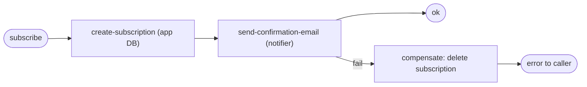

# ADR-004: Оркестрована Saga для підписки

## Статус

Прийнято.

## Контекст

Сценарій підписки охоплює два мікросервіси:

1. `app` — зберігає підписку у власній PostgreSQL;
2. `notifier` — надсилає confirmation email (окремий сервіс, виклик через RabbitMQ).

Це розподілена транзакція: локальний коміт у БД `app` і дія в іншому сервісі.
Спільної ACID-транзакції між ними немає. Якщо створити підписку, але не змогти
відправити лист, користувач залишиться з «підвислою» непідтвердженою підпискою,
яку через унікальний індекс `(email, repositoryId)` не можна навіть повторити.

## Рішення

Реалізовано **оркестровану Saga** з компенсаціями. Оркестратор — сервіс `app`.

Загальний рушій: [src/shared/saga/saga.ts](../src/shared/saga/saga.ts) —
`SagaOrchestrator` виконує кроки послідовно, а при помилці запускає компенсації
завершених кроків у зворотному порядку.

Кроки сценарію ([src/modules/subscriptions/subscribe.saga.ts](../src/modules/subscriptions/subscribe.saga.ts)):

| Крок | Дія | Компенсація |
|---|---|---|
| `create-subscription` | створити pending-підписку в БД `app` | видалити створену підписку |
| `send-confirmation-email` | надіслати команду в `notifier` | немає (лист або надіслано, або ні) |

Якщо крок нотифікації падає (наприклад, брокер недоступний), Saga видаляє
щойно створену підписку — система лишається консистентною.

## Чому Saga, а не 2PC

Двофазний коміт (2PC) вимагає координатора й блокування ресурсів усіх учасників
до завершення, погано працює з асинхронним брокером і знижує доступність.
Для нашого сценарію (короткий бізнес-процес, асинхронний notifier) оркестрована
Saga з компенсаціями простіша, неблокуюча та стійкіша до відмов окремого сервісу.

## Наслідки

- Немає «підвислих» непідтверджених підписок при збоях нотифікації.
- Рушій Saga переюзабельний для інших багатокрокових сценаріїв.
- Компенсація видаляє лише pending-підписку; підтверджені підписки не зачіпаються.
- Логіку оркестратора та кроків покрито unit-тестами (успіх і компенсація).
