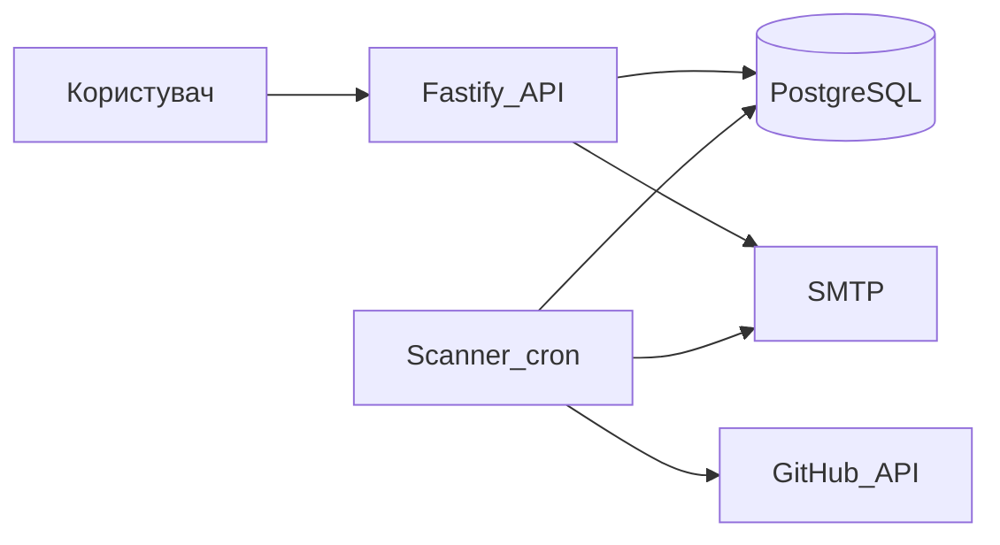
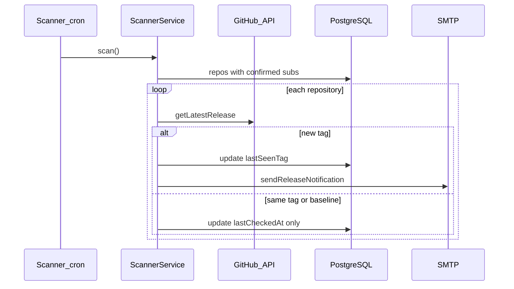

# [SDD] GitHub Release Notifier

* **Статус:** Прийнято (v1); окремі розширення — Proposed
* **Автори:** Ivan (flocky674)
* **Дата створення:** 2026-05-04
* **Останнє оновлення:** 2026-05-04

## 1. Контекст та мета (Background & Goal)

**Бізнес-проблема:** розробники та команди хочуть дізнаватися про нові релізи залежностей або цікавих open-source репозиторіїв без ручного моніторингу сторінки Releases на GitHub.

**Поточне рішення (v1):** веб-сервіс, куди користувач надсилає email і назву репозиторію (`owner/name`). Після підтвердження підписки система періодично перевіряє останній реліз і надсилає email, якщо з’явився новий тег.

**Чому не «просто watch на GitHub»:** не всі користувачі хочуть прив’язку до GitHub-акаунта; потрібен єдиний email-канал для кількох репозиторіїв з одного місця.

**Очікуваний результат v1:**

- double opt-in (підтвердження email перед активною підпискою);
- відсутність «спаму» про реліз, який уже існував на момент підписки (`lastSeenTag`);
- передбачувана поведінка при лімітах GitHub API (429).

Деталі архітектурних рішень — у [ADR-001](ADR-001-vybir-fastify.md) та [ADR-002](ADR-002-vybir-postgresql.md).

## 2. Високорівневий дизайн (High-Level Architecture)

Система — **монолітний Node.js застосунок** з двома основними потоками:

1. **HTTP API (Fastify)** — підписка, підтвердження, відписка, перегляд підписок.
2. **Фоновий сканер (node-cron)** — періодична перевірка релізів і розсилка листів.

Зовнішні залежності: **PostgreSQL** (дані), **GitHub REST API** (релізи), **SMTP** (Nodemailer, напр. Resend).



| Компонент | Відповідальність |
|-----------|------------------|
| `buildApp()` | HTTP, статика, маршрути, помилки, опційний API key |
| `SubscriptionService` | Бізнес-логіка підписок |
| `ScannerService` | Порівняння тегів, нотифікації |
| `GitHubService` / `GitHubClient` | Запити до GitHub |
| `NotifierService` | Листи підтвердження та про реліз |
| Prisma | Доступ до БД |

## 3. Деталі дизайну (Design Details)

### 3.1 Підписка (double opt-in)

1. Клієнт викликає `POST /api/subscribe` з `email` та `repo`.
2. Сервіс перевіряє формат email і `owner/name`, існування репо на GitHub.
3. У БД створюється або оновлюється `Repository`; фіксується поточний `lastSeenTag` (якщо реліз уже є — щоб не слати лист одразу).
4. Створюється `Subscription` з `isActive = false` до підтвердження.
5. На email відправляється лист з посиланням `GET /api/confirm/:token`.
6. Після переходу за посиланням підписка активується (`confirmedAt`, `isActive`).

Повторна підписка на той самий email+repo: якщо ще не підтверджено — повторний лист; якщо вже активна — `409 Conflict`.

### 3.2 Сканер релізів

- Запускається за cron-виразом кожні `SCAN_INTERVAL_MINUTES` хвилин (`scanner.job.ts`).
- Захист від накладення циклів: прапорець `isRunning` — якщо попередній scan ще йде, тик пропускається.
- Для кожного `Repository` з підтвердженими підписками:
  - запит останнього релізу в GitHub;
  - оновлення `lastCheckedAt`;
  - якщо `lastSeenTag` порожній — записати поточний тег без розсилки (базова лінія);
  - якщо тег змінився — лист усім активним підписникам, оновити `lastSeenTag`.
- При `RateLimitError` (429) цикл переривається; наступна спроба — на наступному тику cron.

### 3.3 Відписка та перегляд

- `GET /api/unsubscribe/:token` — деактивація за `unsubscribeToken`.
- `GET /api/subscriptions?email=` — список активних підтверджених підписок для email.

## 4. Схема даних (Data Design)

Реляційна модель у PostgreSQL, ORM — Prisma. Детально — [ADR-002](ADR-002-vybir-postgresql.md).

**Поточні сутності:** `Repository`, `Subscription`.

**Можливе розширення (Proposed):**

| Сутність | Навіщо |
|----------|--------|
| `NotificationLog` | Історія відправлених листів (email, repo, tag, status, timestamp) |
| Індекси | Прискорення пошуку підписок за `email` при великій кількості записів |

## 5. API / інтерфейси (Integration points)

REST API, порт за замовчуванням `3000`. Повна специфікація — [`swagger.yaml`](../swagger.yaml).

| Метод | Шлях | Опис |
|-------|------|------|
| POST | `/api/subscribe` | Створити підписку, надіслати confirmation email |
| GET | `/api/confirm/:token` | Підтвердити підписку |
| GET | `/api/unsubscribe/:token` | Відписатися |
| GET | `/api/subscriptions?email=` | Список підписок |
| GET | `/health` | Health check |

**Приклад підписки:**

```http
POST /api/subscribe
Content-Type: application/json
X-API-Key: <optional, якщо задано API_KEY>

{
  "email": "user@example.com",
  "repo": "golang/go"
}
```

**Успішна відповідь (200):**

```json
{
  "message": "Confirmation email sent"
}
```

**Помилки:** `400` (валідація), `404` (репо не знайдено), `409` (вже підписаний), `429` (ліміт GitHub), `401` (невірний API key).

## 6. Вимоги до системи та обмеження (Requirements & Constraints)

### Функціональні

- Підписка на релізи GitHub-репозиторію за email з підтвердженням.
- Відписка за унікальним токеном.
- Періодична перевірка нових тегів і email-сповіщення.
- Не надсилати лист про реліз, який існував на момент першої підписки на репо.

### Нефункціональні

- Інтервал скану налаштовується (`SCAN_INTERVAL_MINUTES`, за замовчуванням 5 хв).
- Опційний захист write/read API ключем (`API_KEY`, заголовок `X-API-Key`); публічні шляхи: `/`, `/health`, confirm/unsubscribe.
- Логування через Pino (структуровані логи в консоль).
- Обмеження GitHub API: без токена — нижчі ліміти; рекомендовано `GITHUB_TOKEN`.

### Обмеження

- Один процес: API і cron в одному `server.ts` (немає окремого worker-сервісу в v1).
- Email залежить від SMTP-провайдера (обмеження free tier, напр. Resend).
- Немає UI адмін-панелі — лише проста статична сторінка в `public/`.

## 7. Альтернативи (Alternative Solutions Considered)

| Тема | Розглянуто | Чому не обрано в v1 |
|------|------------|---------------------|
| HTTP-фреймворк | Nest.js, Express | Fastify — менше складності, див. ADR-001 |
| БД | MongoDB, SQLite | PostgreSQL + Prisma — див. ADR-002 |
| Оновлення релізів | **GitHub Webhooks** | Потрібен публічний endpoint і реєстрація webhook; polling простіший для старту |
| Фонові задачі | Черга (Redis + Bull) | Для малого навантаження достатньо in-process cron |
| Деплой | Kubernetes | Docker Compose достатній для навчального / pet-проєкту |

**Майбутнє (Proposed):** webhooks для миттєвих сповіщень; винесення сканера в окремий worker; черга для retry листів при збоях SMTP.

## 8. Безпека та моніторинг (Security & Observability)

### Безпека

- Секрети лише в змінних середовища (`.env`, не в git).
- Токени confirm/unsubscribe — випадкові UUID, унікальні в БД.
- Опційний `API_KEY` для захисту API від сторонніх запитів.
- Валідація вводу (email, формат `owner/name`).

### Observability (поточна v1)

- Логи: рівні info/warn/error у scanner та API.
- Health endpoint для перевірки живості процесу.

### Observability (Proposed)

- Метрики: кількість підписок, тривалість scan, кількість 429, failed emails.
- Алерти при серії помилок SMTP або GitHub.
- Трейсинг запитів (OpenTelemetry) — за потреби при зростанні навантаження.

## 9. План впровадження (Rollout Plan)

| Етап | Дія |
|------|-----|
| 1. Локально | `docker compose up` або `npm run dev`, міграції Prisma |
| 2. CI | GitHub Actions: `npm ci`, `prisma generate`, `npm run lint`, `npm test` (`.github/workflows/ci.yml`, `lint.yml`) |
| 3. Staging / prod | Збірка Docker-образу, `DATABASE_URL`, SMTP, `GITHUB_TOKEN`, `APP_URL` |
| 4. Rollback | Повернення попереднього Docker-образу та відкат міграції Prisma за процедурою команди |


## 10. Тестування (Testing Strategy)

### Поточна v1

- **Unit-тести (Vitest):** `tests/unit/` — `parse-repo`, `SubscriptionService`, `ScannerService` з моками репозиторіїв і GitHub.
- Запуск: `npm test`.

### Заплановано (Proposed)

| Рівень | Що перевіряти |
|--------|----------------|
| Integration | API + Prisma + test Postgres (testcontainers або CI service) |
| E2E | Повний сценарій subscribe → confirm (mock SMTP) |
| Contract | Відповідність відповідей `swagger.yaml` |

## 11. Якість коду (Quality Assurance)

| Практика | Реалізація |
|----------|------------|
| Статичний аналіз | ESLint (`npm run lint`), TypeScript |
| CI | Lint + unit tests на кожен push/PR |
| Code review | Peer review PR |
| Міграції БД | Версіоновані SQL у `prisma/migrations/` |
| Документація рішень | ADR-001, ADR-002, цей SDD |


## Діаграма послідовності: новий реліз


