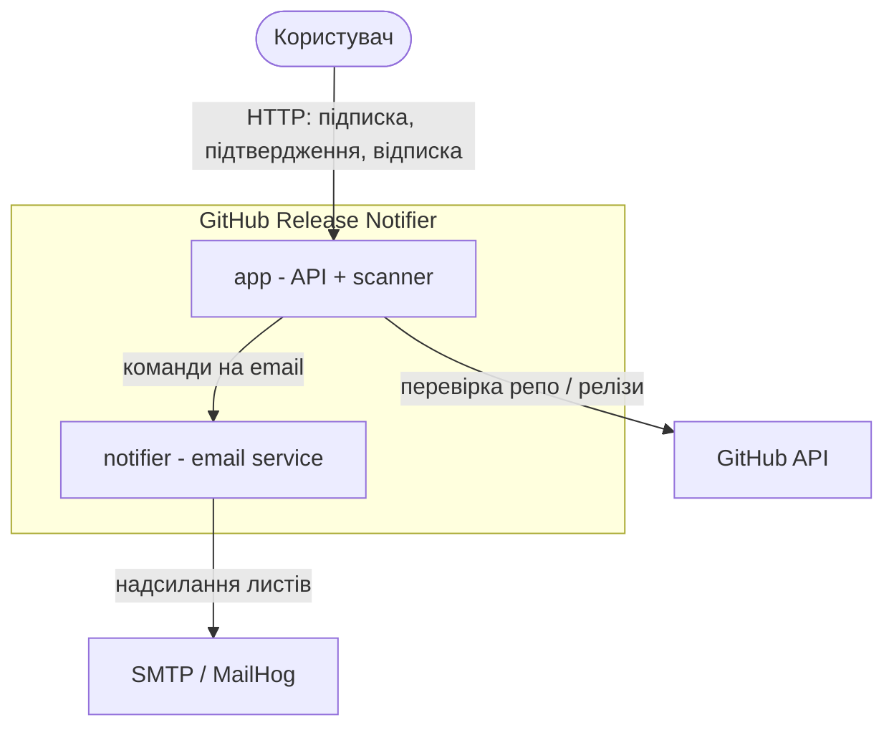
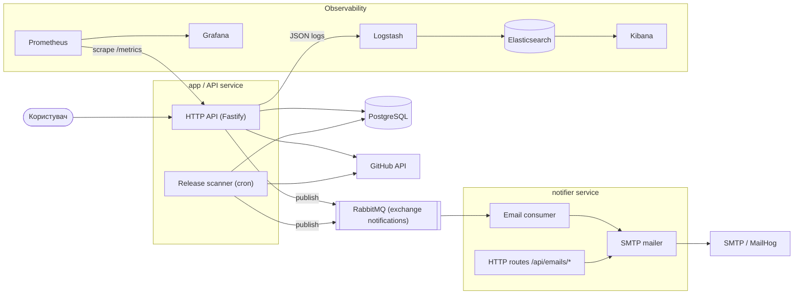
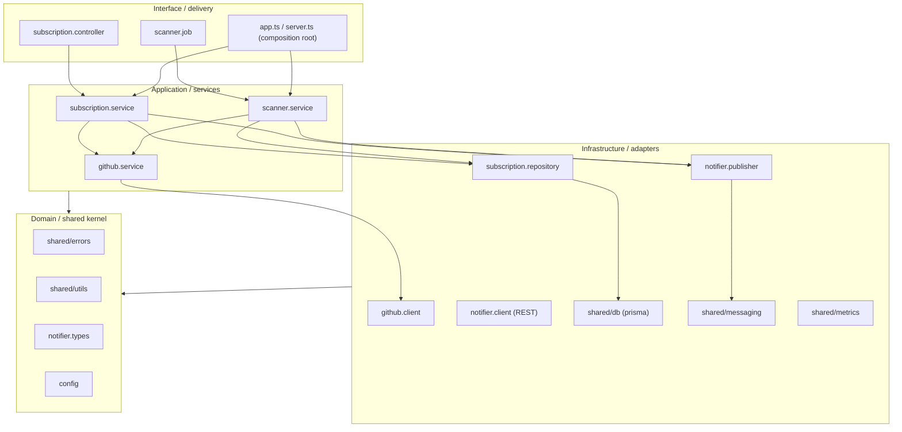
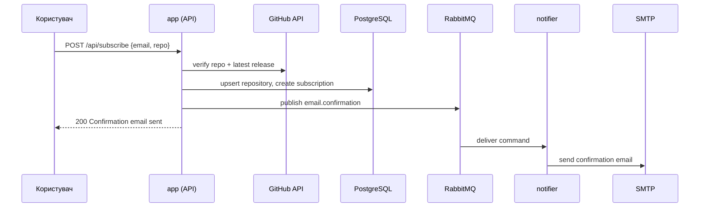
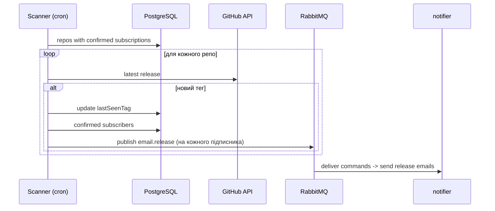

# Архітектура застосунку

GitHub Release Notifier — сервіс підписки на email-сповіщення про нові релізи
GitHub-репозиторіїв. Складається з двох сервісів (`app` і `notifier`) та
інфраструктури (PostgreSQL, RabbitMQ, стек спостережуваності, MailHog).

## 1. System context



## 2. Container diagram



## 3. Компонентна структура `app` (шари)



Правило напряму залежностей: `interface → application → infrastructure`, і всі
шари можуть залежати від `domain` (shared kernel). Зворотних залежностей немає
(наприклад, infrastructure не імпортує application). Це перевіряється
автоматично — див. розділ 6.

## 4. Потік підписки (sequence)



## 5. Потік сканування релізів (sequence)



## 6. Шари та тести архітектурних залежностей (зірочка)

Шари визначено за розташуванням файлів:

| Шар | Файли |
|---|---|
| Interface | `*.controller.ts`, `*.job.ts`, `app.ts`, `server.ts` |
| Application | `*.service.ts` |
| Infrastructure | `*.repository.ts`, `*.client.ts`, `*.publisher.ts`, `shared/db`, `shared/messaging`, `shared/metrics` |
| Domain (shared kernel) | `shared/errors`, `shared/utils`, `*.types.ts`, `config` |

Правила залежностей закодовано в [.dependency-cruiser.cjs](../.dependency-cruiser.cjs)
і перевіряються тестом [tests/unit/architecture.test.ts](../tests/unit/architecture.test.ts):

- відсутність циклічних залежностей;
- infrastructure не залежить від application;
- application/infrastructure не залежать від interface;
- domain (shared kernel) не залежить від жодного вищого шару.

Запуск:

```bash
npm run arch:validate   # dependency-cruiser
npm run test:unit       # включає architecture.test.ts
```
